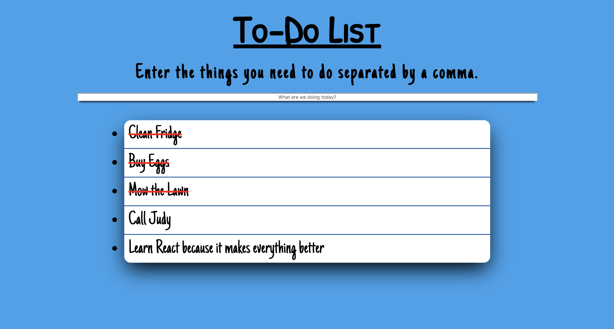

# To-Do List
Celeste Robinson

## Objective

This was one of the first projects I did after learning the basics of JavaScript and jQuery. The goal was to create a program that allows the user to add tasks to a todo list. They can then cross them off when they have finished. The user can also add multiple things to the todo list if they are separated by a comma.

### Web View


## Technologies Used
* HTML, CSS, JavaScript, jQuery

## Code Examples
In this project, I used JavaScript and jQuery. Below is the JavaScript function that adds a new task to my list of tasks. We create a new ```li``` element, then a text node with the name of the new task that the user will type in. We then append the task to the ```li``` element we created. We then give each ```li``` an id of the name of the new task. Finally, we append that ```li``` to the ```ul```, which is the unordered list we created in the HTML.

```
function addTask(newTask) {
    var newLi = document.createElement("li");
    var ul = document.getElementById("list");
    var task = document.createTextNode(newTask);
    newLi.appendChild(task);
    newLi.setAttribute('id', newTask);
    ul.appendChild(newLi);
    newLi.onclick = strikethrough;
}
```

There was one thing at this time that I was super excited to learn about. Toggling classes. This opened up a whole new world of CSS capabilities for me. In this code, I toggle a class called 'item' on and off. This allows me to use a CSS selector and give it properties with values. These function is being passed through my ```addTask``` function, which is then being called in another function that fires on enter. ```onClick``` of a list item, the ```strikethrough``` function fires, toggling whatever I have set in the CSS. In this case, I have a ```text-decoration: underline``` set. This adds an easy way to cross off items on the to-do list.

```
function strikethrough(event) {
    $(this).toggleClass('item');
}
```

## Future Ideas

I want to build a full-stack to-do list with the new technologies I have learned since I did this project. 